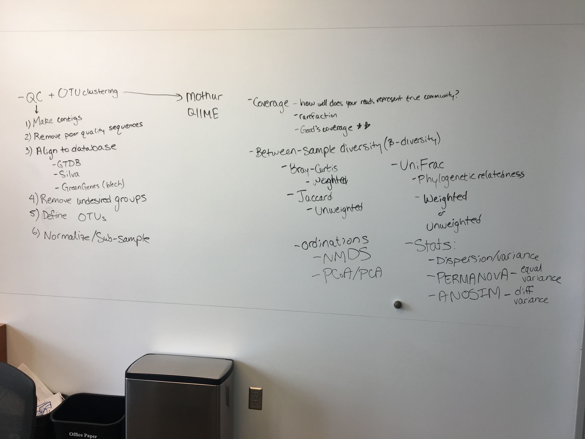

# 16S Amplicon Sequencing Analyses & Best Practices 

*2019-10-17*
*Edna Chiang, Department of Bacteriology*

### Tools

- mothur
- QIIME2
- DADA2 (de novo assignment of OTUs or amplicon sequence variants (ASVs))

### Quality Control

1. Make contgis
2. Remove poor quality sequences

- Create contigs of reverse and forward reads to increase your confidence in reads and amplicon
- Remove homopolymers, low scoring bases

### OTU Clustering

1. Alignment
2. Remove undesired groups
3. Cluster and define OTUs 

OTU = Operational taxonomic unit. The taxonomic unit is usually defined by a sequence percent identity cutoff, such as clustering sequences of 95% sequence identity into an OTU. Species-cutoff for 16S usually around 97% sequence identity. Aligning to a database to make sure you have all 16S sequences, and to then assign taxonomy to your sequences.  Two main databases, Silva and Greengenes. Silva is usually recommended because it is updated more often and contains more environmental sequences, whereas Greengenes hasn't been updated since 2013 and is conists more of gut microbes. The genome taxonomy database (GTDB) also has their own formatted database that matches their metagenomic taxonomical assignment database. 

### Normalization and Sub-sampling

Rarefaction to remove samples with low coverage or singletons/doubletons OTUs. How well do your reads represent the community by coverage, total sequencing sampled vs uniqued samples was the old way to rarefy samples. Use Good's coverage which is the proportion of true community that captures, such as have a Good's coverage of 95% or higher, then can keep that samples. 

### Statistical Tests

- Between sample diversity = beta diversity.  
- Bray-Curtis distance = weighted
- Jaccard distance = unweighted
- UniFrac distance - unweighted or weighted, also takes phylogenetic relatedness into account

Ordinations are for visualizing your distances matrices in 2-dimensional space. How you would visualize how different sets of samples or treatments differ by taxonomic contributions. This is taking a large dissimilarity matrix and forcing it into a 2D plane and could distort it. The "stress" value is a measure of how accurately the 2D ordination represents your matrix. If stress value greater than 0.2, than too distorted and probably shouldn't use that ordination method. 

- NMDS: arbitrary axes
- PCoA/PCA: nonarbitrary axes

PCoA is usually less distorted because the axes are not arbitrary. Statistical tests depend on the distribution of your beta diversity, or the dispersion/variance. If the variance is significantly different, then you cnan use PERMANOVA test to statistically test the difference in phylogenetic composition between treatment groups, such as antibiotics and no antibiotics treatment groups. If the B diverstiy/variance is equal, then you cannot use a PERMANOVA test. Use an ANOSIM test. PERMANOVA is flexibile for comparisons, whereas ANOSIM uses 1 comparison at a time. PERMANOVA works for both categorical and continuous variables. 

