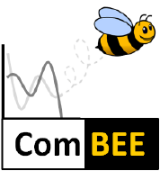

# ComBEE 'Omics Study Group @ UW-Madison  

Welcome to the ComBEE's 'Omics Study Group held at UW-Madison! We are a group of researchers interested in applying computational genomics techniques to research focussed in ecology and evolution. Check out material from our previous sessions [here](https://github.com/ComBEE-UW-Madison/OmicsStudyGroup),

## Join us!
Sign up for our listserv by sending a blank email to [join-combee@lists.wisc.edu](mailto:join-combee@lists.wisc.edu).

## Upcoming events
Fall 2019 'Omics Study Groups are held on Thursdays from 2-3 PM in the Wisconsin Institute for Discovery in room 1153/54. 

- October 10th: Jenny Bratburd, Comparative Genomics Methods
- October 17th: Edna Chiang, 16S Amplicon Analyses
- October 24th: Data Science & Microbiome Hubs, Reference-Based Shotgun Metagenomics
- October 31st: Elizabeth McDaniel, Annotation Methods and Databases
- November 14th: Ben Peterson, Genome/Metagenome Assembly
- November 21st: Ben Peterson, Phylogenetics & Tree-thinking
- December 5th: Elizabeth McDaniel, Best Practices in Metagenomic Binning

If you have any suggestions for improving 'Omics Study Group, potential sessions, or leading your own session, please contact the ComBEE team! 

Elizabeth McDaniel: emcdaniel@wisc.edu  
Kirsten Gotting: gotting@wisc.edu  
Mikey Kartje: kartje@wisc.edu  

[Click here for more info about the ComBEE organization website](https://combee-uw-madison.github.io/studyGroup/)

